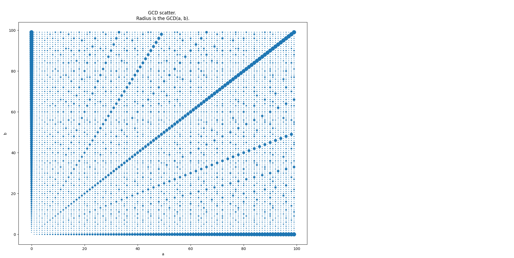
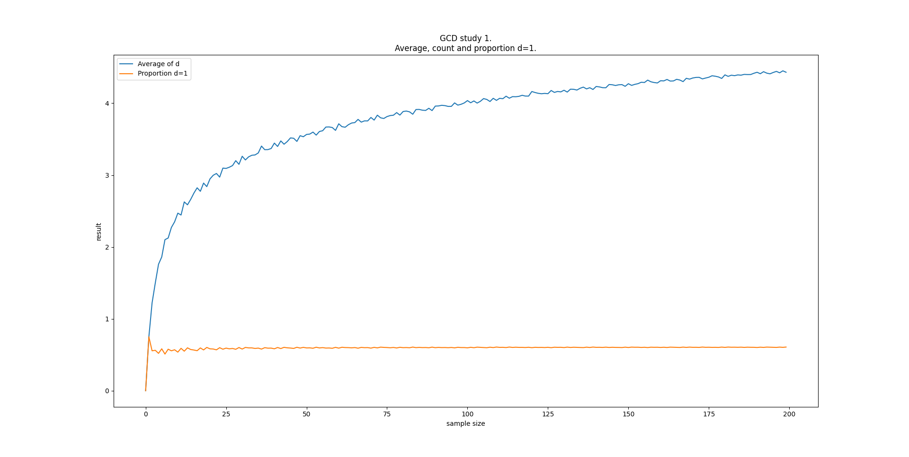
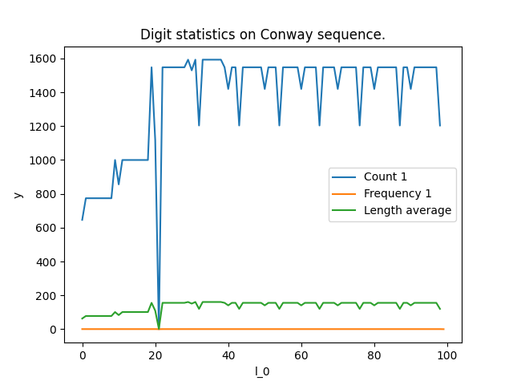

# Arithmetics.

Solve, illustrate different problems about digits, enumeration, discrete calculus.

With Python, here, are ran smaller problems or that are easy to visualize.
See [Rust repository](https://github.com/Detroix23/arithmetics_rs) for computation of very large numbers.

## Consecutive signed sums.
From the _Concours General de Mathématiques des Lycées 2026_.

## Digital counters.
Simulate counters, in base 10 and in roman numbers.

Try to find the best combination for the minimal counter.

## Dividers and GCD.

GCD studies: 
- Plotting the $ℕ×ℕ$ plane.



- Measuring, for up to $n$, average $d(n)$, frequency $f_1(n)$ for $GCD(a, b) = 1$. It looks like:
	- $f_1(n) → 0.60$
	- $d(n) → ln(n)$



## Conway sequence.
_Conway sequence_ or _look-and-say sequence_.

It beggins as:
```
1, 11, 21, 1211, 111221, 312211, 13112221, 1113213211, 31131211131221
```

**Sources:**
- https://en.wikipedia.org/wiki/Look-and-say_sequence

Basic counting and overviews:
- Digit count, frequency, value length.




## License.
CC-BY 4.0 

See full document:
[LICENSE.md](./LICENSE.md)

_By **Detroix23**_
